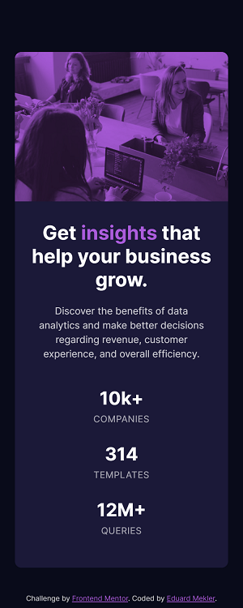

# Frontend Mentor - Stats preview card component solution

This is a solution to the [Stats preview card component challenge on Frontend Mentor](https://www.frontendmentor.io/challenges/stats-preview-card-component-8JqbgoU62). Frontend Mentor challenges help you improve your coding skills by building realistic projects. 

## Table of contents

- [Overview](#overview)
  - [The challenge](#the-challenge)
  - [Screenshot](#screenshot)
  - [Links](#links)
- [My process](#my-process)
  - [Built with](#built-with)
  - [What I learned](#what-i-learned)
  - [Continued development](#continued-development)
- [Author](#author)
- [Acknowledgments](#acknowledgments)

**Note: Delete this note and update the table of contents based on what sections you keep.**

## Overview

### The challenge

Users should be able to:

- View the optimal layout depending on their device's screen size

### Screenshot




### Links

- Solution URL: [GitHub Repository](https://github.com/emekler0729/fem-stats-preview-card-components)
- Live Site URL: [GitHub Pages](https://emekler0729.github.io/fem-stats-preview-card-components/)

## My process

### Built with

- Semantic HTML5 markup
- CSS custom properties
- Mobile-first workflow
- Flexbox

### What I learned

#### Monochrome Image Filter

In this exercise, I learned how to add a monochrome filter to an image. The key was to put the image in a wrapper and set its background to the desired overlay color. Then the image is added as a *background* to a child element of the wrapper. Finally, `mix-blend-mode: multiply` is used in combination with `opacity` adjustments to create the final color and contrast. The `mix-blend-mode` property blends the *backgrounds* of a parent and child element.

The one factor that I didn't like about this solution is that because the image is added as a background, the height of the wrapper element must be set explicitly and does not automatically scale to the image size.

```html
<div class="img-wrap">
  <div class="img"></div>
</div>
```
```css
.card .img-wrap {
    background-color: var(--accent);
    height: 230px;
    width: auto;
    border-radius: 3% 3% 0 0;
}

.card .img-wrap::after {
    background-image: url('../images/image-header-mobile.jpg');
    background-size: cover;
    background-repeat: no-repeat;
    mix-blend-mode: multiply;
    opacity: 0.8;
    height: 100%;
    width: auto;
}
```
### Continued development

Per the stated design specification, I optimized this component for viewing at 375px and 1440px screen widths; however, the design approach I took leaves responsive glitching and visual artifacts at intermediate widths. The design could be further refined to be responsive at all widths.

## Author

- GitHub - [@emekler0729](https://github.com/emekler0729)
- Frontend Mentor - [@emekler0729](https://www.frontendmentor.io/profile/emekler0729)

## Acknowledgments

Thanks to Joekahora on GitHub from whom I learned the Monochrome Image Filter solution.

Github - [@Joekahora](https://github.com/Joekahora/stats-preview-card)